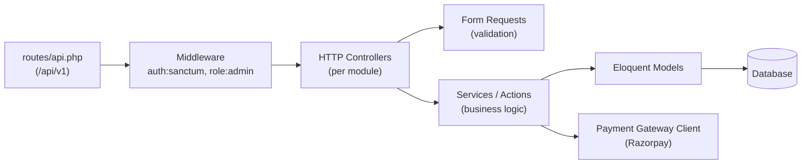

# Backend Architecture

Status legend: see [root README](../README.md).

## CURRENT (`IMPLEMENTED`)

Laravel 13 (PHP ^8.3) at `apps/lara_ecom`, verified files:

| Component | File | State |
|---|---|---|
| Application bootstrap | `bootstrap/app.php` | Web + console routing, `/up` health, JSON-when-`api/*` exceptions |
| User model | `app/Models/User.php` | Default: `name`, `email`, `password`; hashed cast; hidden `password`/`remember_token`; `email_verified_at` cast |
| Base controller | `app/Http/Controllers/Controller.php` | Empty base class |
| Routes | `routes/web.php` | Welcome page only |
| Migrations | `database/migrations/` | users (incl. password_reset_tokens, sessions), cache, jobs |
| Tests | `tests/Feature`, `tests/Unit` | Framework `ExampleTest` stubs only |

Runtime facts: SQLite database, `database` drivers for session/cache/queue, `log` mail/broadcast, APP_DEBUG=true locally.

## TARGET MVP LAYERING (`REQUIRED`)

Conventional Laravel structure, one module slice per bounded context:

Proposed module boundaries (each gets controllers, requests, models, migrations, policies, feature tests):

| Module | Contents | Doc |
|---|---|---|
| Auth | register, login, logout, me | [02-authentication](../02-authentication/README.md) |
| Catalog | Category, Product, ProductImage | [05](../05-categories/README.md), [06](../06-products/README.md) |
| Inventory | Stock on product, decrement on order | [07-inventory](../07-inventory/README.md) |
| Shopping | Cart, CartItem | [08-cart](../08-cart/README.md) |
| Address | Address CRUD, default flag | [09-addresses](../09-addresses/README.md) |
| Checkout | Quote/validation/orchestration | [10-checkout](../10-checkout/README.md) |
| Orders | Order, OrderItem, status machine | [11-orders](../11-orders/README.md) |
| Payments | Payment entity + Razorpay adapter | [12-payments](../12-payments/README.md) |
| Admin | Admin controllers + policies | [14-admin](../14-admin/README.md) |

## API Base & Versioning

- Base path: `/api/v1` (`REQUIRED` — `routes/api.php` does not exist yet).
- Exceptions already render JSON on `api/*` paths (`IMPLEMENTED` in `bootstrap/app.php`), so error-format groundwork exists.

## Conventions (proposed)

- Form Request classes for all write validation.
- HTTP status codes: 200 OK, 201 Created, 204 No Content, 422 Validation, 401 Unauthenticated, 403 Unauthorized, 404 Not Found, 409 Conflict (e.g. stock), 500 Server.
- Timestamps (`created_at`, `updated_at`) on all domain tables; `soft_deletes` only where needed (TBD per table).
- Money stored as integers (paise) — TBD confirmation in [10-checkout/pricing.md](../10-checkout/pricing.md).
