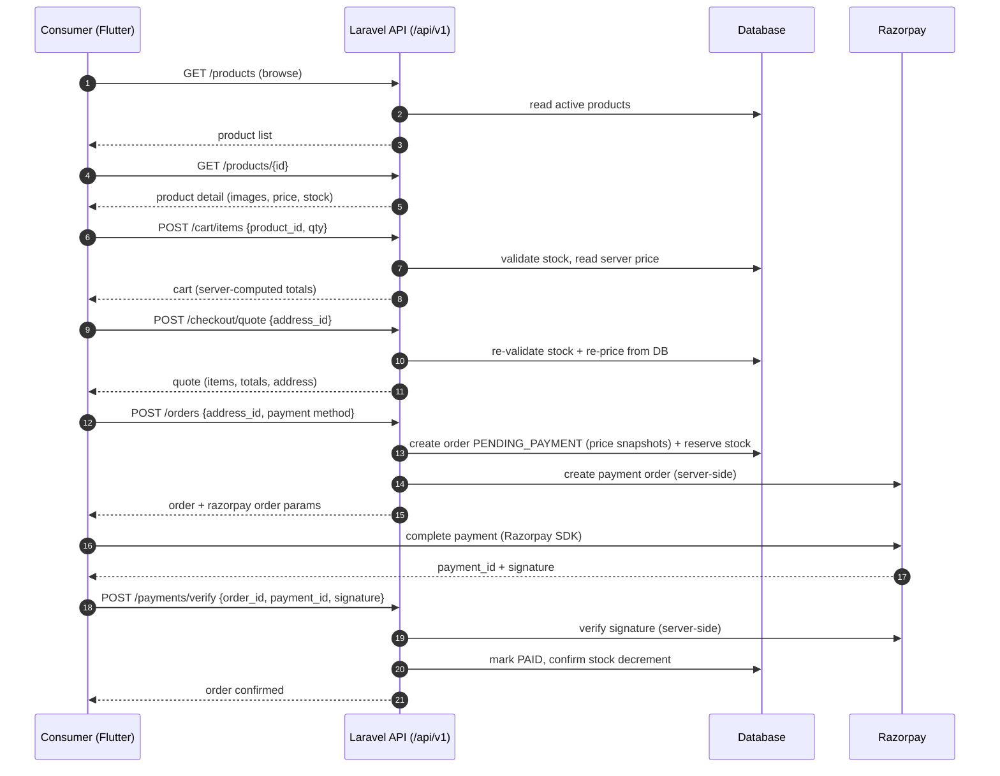
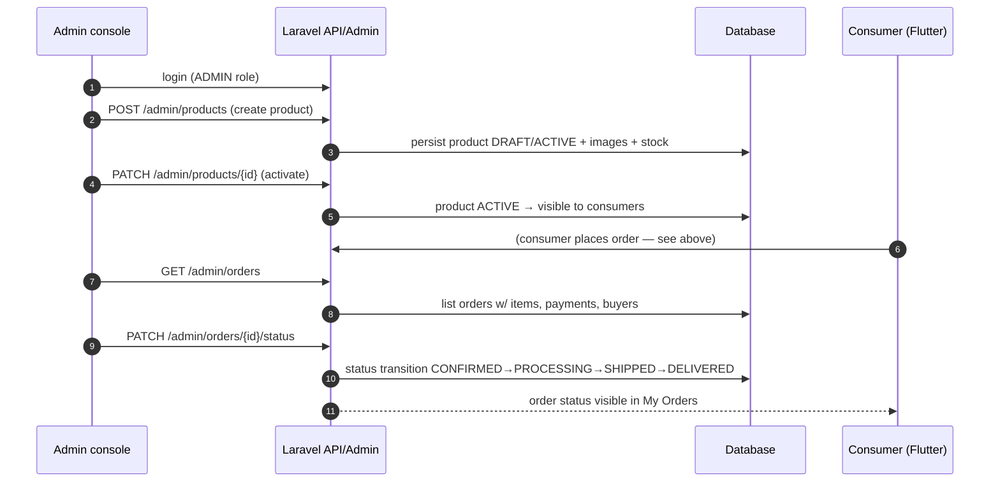

# Data Flow

Status legend: see [root README](../README.md). All flows below are **TARGET MVP** (`REQUIRED`) — none exists in code yet; diagrams define the contract the implementations must satisfy.

## Purchase flow (the money path)

## Seller order-management flow

## Key rules encoded in these flows

1. **Prices always come from the database** at quote/checkout time — never from client-sent amounts ([08-cart/business-rules.md](../08-cart/business-rules.md), [10-checkout/pricing.md](../10-checkout/pricing.md)).
2. **Stock is re-validated at checkout** even though the cart validated it earlier ([07-inventory/stock-flow.md](../07-inventory/stock-flow.md)).
3. **Order stores price snapshots** so later catalog changes don't alter historical orders ([11-orders/order-model.md](../11-orders/order-model.md)).
4. **Payment verification is server-side** — the client never authenticates a payment by asserting success ([17-security/payment-security.md](../17-security/payment-security.md)).
5. Address is **snapshotted onto the order** at creation ([09-addresses/business-rules.md](../09-addresses/business-rules.md)).
