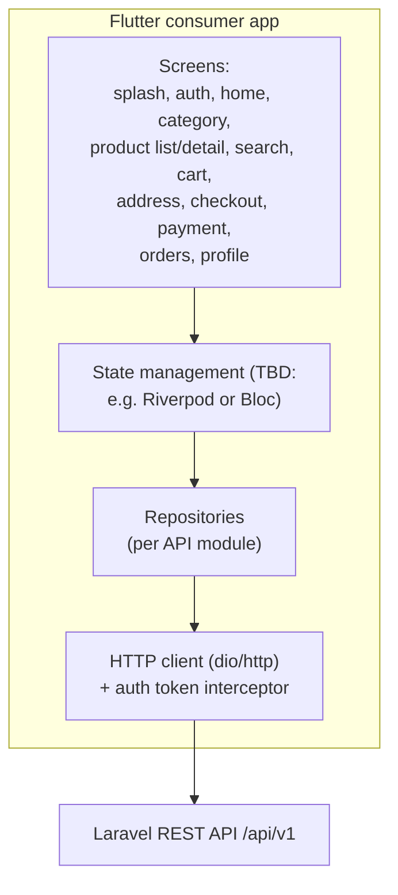

# Frontend Architecture

Status legend: see [root README](../README.md).

## Consumer mobile app — CURRENT (`IMPLEMENTED` skeleton)

- **Stack:** Flutter 3.38.6 stable, Dart 3.10.7 (`apps/ecom_mob`). Verified dependencies: `flutter` SDK + `cupertino_icons` only; single `lib/main.dart` counter template; one widget smoke test in `test/`.
- **Platforms scaffolded:** Android, iOS, web, Linux, macOS, Windows (`IMPLEMENTED`).
- Org: `com.ecomproj`, project name `ecom_mob`.
- No state management, routing, HTTP client, or design system present yet — all `REQUIRED` (choices TBD; see TBD decisions below).

## TARGET MVP STRUCTURE (`REQUIRED`)

TBD decisions before implementation (tracked in [documentation-status.md](../documentation-status.md)):

- State management: **TBD** (Riverpod vs Bloc)
- Navigation/routing package: **TBD** (go_router suggested, unnamed elsewhere)
- Model/codegen approach: **TBD** (freezed/json_serializable suggested)

## Admin console — `REQUIRED` (nothing exists)

Two viable options; final choice **TBD**:

1. Server-rendered Laravel views (Blade) with Vite/Tailwind — fastest path, leverages the existing Vite build.
2. Separately built SPA served from the same repo.

Either way it is protected by the `ADMIN` role. Screens and capabilities: [14-admin](../14-admin/README.md).

## Build & Tooling (`IMPLEMENTED`)

- Frontend asset build runs under Turborepo: `pnpm turbo build` executes `vite build` in `apps/lara_ecom` (cached via `public/build/**`).
- Mobile build under Turborepo: `flutter build apk --debug` via `apps/ecom_mob/package.json` (cached via `build/app/outputs/**`).
- Note: the admin console option (1) would also rely on the existing Vite/Tailwind stack already wired in `apps/lara_ecom`.
