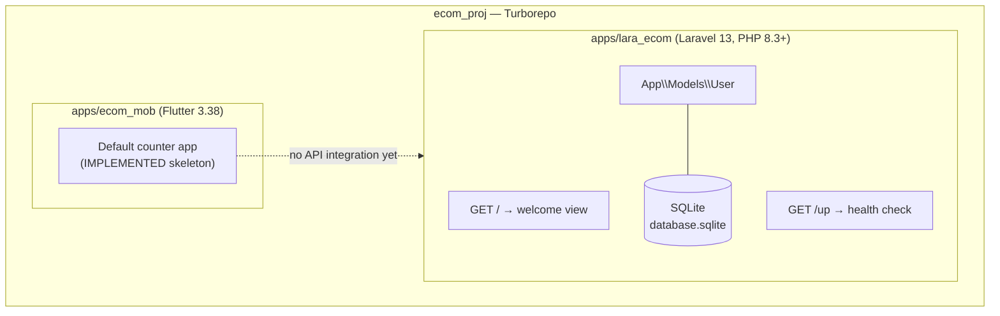
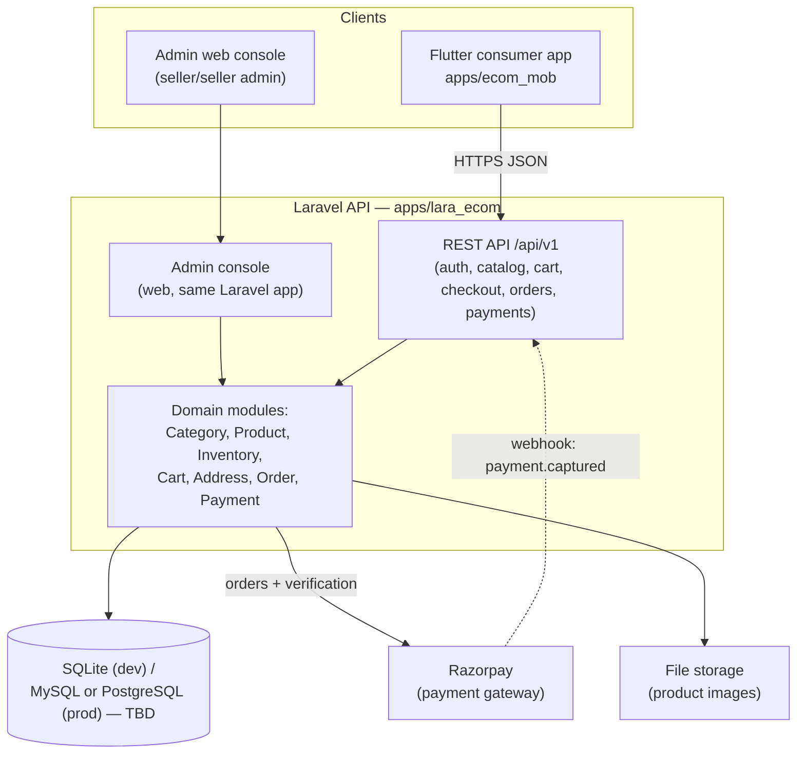

# System Architecture

Status legend: see [root README](../README.md).

## CURRENT ARCHITECTURE (what exists today — `IMPLEMENTED`)

Verified facts (2026-10-04):

| Component | State |
|---|---|
| `routes/web.php` | Single welcome route only |
| `routes/api.php` | **Does not exist** |
| `app/Http/Controllers` | Base `Controller.php` only |
| `app/Models` | `User.php` only |
| Migrations | Framework defaults: users, cache, jobs |
| Exception handling | JSON responses when `api/*` or `expectsJson()` (configured in `bootstrap/app.php`) |
| Flutter `lib/` | `main.dart` counter template only |

## TARGET MVP ARCHITECTURE (`REQUIRED` — nothing below exists yet)

### Applications

| App | Path | Role | Status |
|---|---|---|---|
| Flutter mobile | `apps/ecom_mob` | Consumer shopping app | Skeleton `IMPLEMENTED`, screens `REQUIRED` |
| Laravel backend + admin | `apps/lara_ecom` | REST API + seller console | Skeleton `IMPLEMENTED`, API/console `REQUIRED` |
| Turborepo tooling | root | Build/dev orchestration, caching | `IMPLEMENTED` |

### Services

| Service | Purpose | Status |
|---|---|---|
| Razorpay | Online payment capture + verification + webhooks | `REQUIRED` |
| Local file storage | Product image storage (`storage/app/public`) | `REQUIRED` (Laravel storage exists; link/config for images `REQUIRED`) |
| Queue/database | Laravel default `jobs` table (unused so far) | `IMPLEMENTED` (unused) |
| Mail | Laravel `log` driver currently | `IMPLEMENTED` (log only; real transactional mail `FUTURE`) |

### Mobile application

Single Flutter app for the consumer. A separate seller mobile app is not planned — sellers use the web admin console.

### Admin application

Server-rendered or SPA web console served by the Laravel app, protected by the `ADMIN` role. See [14-admin](../14-admin/README.md).

### Database

SQLite is the current dev database (`IMPLEMENTED`). Production engine is `TBD` (MySQL vs PostgreSQL) — see [19-deployment/production.md](../19-deployment/production.md).

### External services

Razorpay is the only external service required for MVP. Everything else is FUTURE ([21-future-scope](../21-future-scope/README.md)).
