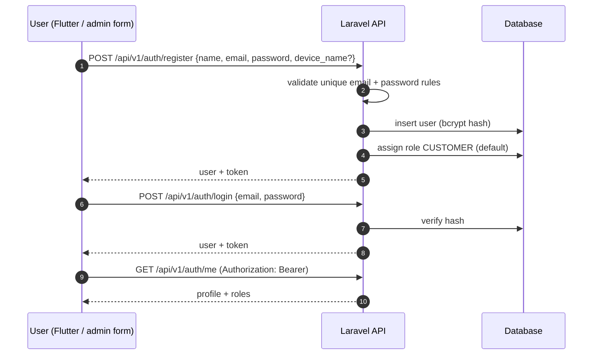
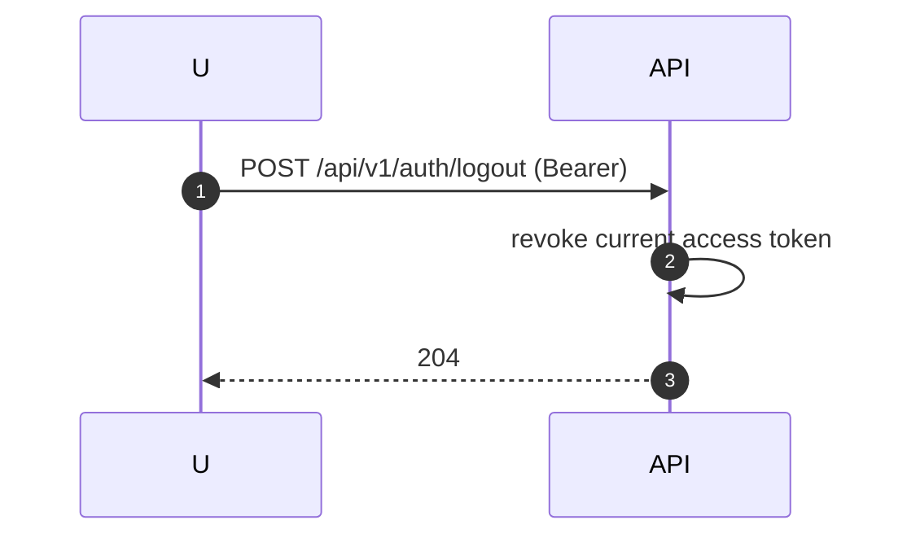

# Authentication Flow

Status legend: see [root README](../README.md). **Everything on this page is `REQUIRED`** except the underlying `User` model (`PARTIALLY IMPLEMENTED` — Laravel default supports this design unchanged).

## Registration → Login → Authenticated calls

## Logout

## Modes

| Mode | Surface | Status |
|---|---|---|
| Token (Sanctum personal access tokens) | Flutter app | `REQUIRED` |
| Session cookie | Admin console (same-origin) | `REQUIRED`, option TBD |

## Password handling (`REQUIRED` rules)

- Hashing: bcrypt, `BCRYPT_ROUNDS=12` (already configured in env — `IMPLEMENTED` default).
- Password cast `hashed` on `User` (`IMPLEMENTED`) prevents storing plaintext by accident.
- Minimum policy TBD: default suggestion ≥8 chars, no complexity beyond common rules; confirmation field on change.
- `password` and `remember_token` hidden on serialization (`IMPLEMENTED`).

## Token/session management

- Token lifetime: personal tokens don't expire by default — set an expiry policy, **TBD**.
- One token per device (Sanctum `device_name`), enabling per-device logout.
- Refresh-token strategy: not planned for MVP (long-lived tokens) — **TBD** pending security review in [17-security/authentication.md](../17-security/authentication.md).

## Error handling (target)

| Case | Response |
|---|---|
| Bad credentials | `422` with field error or `401` — TBD which convention; pick one and document here |
| Unauthenticated on protected route | `401 JSON` (Laravel already renders JSON for `api/*` — `IMPLEMENTED` groundwork) |
| Validation failure | `422` with errors object |

## Authorization interaction

Authentication establishes identity; authorization (roles) then gates admin capability. Both are `REQUIRED`; the contract is in [04-roles-permissions/access-control.md](../04-roles-permissions/access-control.md).
