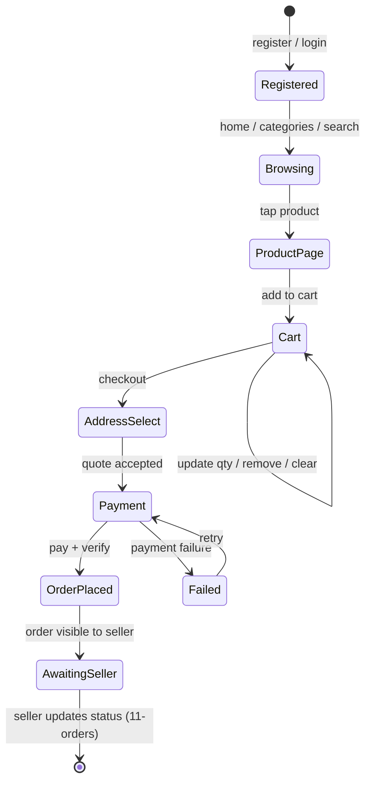

# Customer Flow

Status legend: see [root README](../README.md). All states `REQUIRED` — the backbone is the demo flow from [00-project-overview](../00-project-overview/mvp-scope.md).

| Stage | Component | Doc |
|---|---|---|
| Browsing | product listing, search | [06-products](../06-products/README.md), [13-consumer-app](../13-consumer-app/README.md) |
| Cart | server-side cart | [08-cart](../08-cart/README.md) |
| Checkout | quote → validation → order prep | [10-checkout](../10-checkout/README.md) |
| Payment | Razorpay | [12-payments](../12-payments/README.md) |
| Order history | My Orders / details | [11-orders](../11-orders/README.md) |
