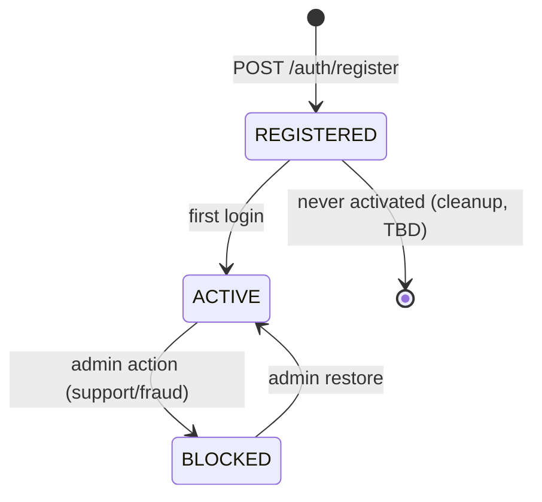

# User Model

Status legend: see [root README](../README.md).

## Entity: `User`

**Status:** `PARTIALLY IMPLEMENTED` — attributes below marked ✅ exist in `app/Models/User.php` + `create_users_table` migration; the rest is `REQUIRED`.

| Field | Type | Exists today | Notes |
|---|---|---|---|
| `id` | bigint PK | ✅ | |
| `name` | string | ✅ | |
| `email` | string, unique | ✅ | login identity |
| `email_verified_at` | timestamp, nullable | ✅ | verification flow `PLANNED` |
| `password` | string (hashed) | ✅ | bcrypt, hidden on serialize |
| `remember_token` | string, nullable | ✅ | hidden |
| `phone` | string, nullable | ❌ `REQUIRED` | TBD whether editable/verified |
| `status` | enum active/blocked | ❌ `REQUIRED` | see lifecycle |
| `created_at`, `updated_at` | timestamps | ✅ | audit fields |

## Special users

- **Customer** — any registered user with role `CUSTOMER` ([04](../04-roles-permissions/roles.md)). Default at registration.
- **Seller/Admin** — seeded user(s) with role `ADMIN`, created via seeder, **never** via the public register API ([02-authentication/api.md](../02-authentication/api.md)).

## User Lifecycle

| State | Meaning | Status |
|---|---|---|
| REGISTERED/ACTIVE | Normal usable account | `REQUIRED` (implicit default today — new users are simply accepted) |
| BLOCKED | Login rejected, orders preserved | `REQUIRED` |

## Profile

- View: `GET /auth/me` returns profile + roles.
- Update: `PATCH /users/me` (`REQUIRED`) — editable fields TBD: `name`, `password` (with confirmation); `phone` editability TBD.
- Deletion: not planned for MVP — `PLANNED` (Later/FUTURE when regulatory review happens).

## Relationships

| Related | Cardinality | Status | Docs |
|---|---|---|---|
| Roles | many-to-many via `role_user` | `REQUIRED` | [04](../04-roles-permissions/roles.md) |
| Addresses | one-to-many | `REQUIRED` | [09-addresses](../09-addresses/README.md) |
| Cart | one-to-one (active cart) | `REQUIRED` | [08-cart](../08-cart/README.md) |
| Orders | one-to-many | `REQUIRED` | [11-orders](../11-orders/README.md) |
| Payments | one-to-many (via orders) | `REQUIRED` | [12-payments](../12-payments/README.md) |

## Account status rules (`REQUIRED`)

- Blocked users: existing `PENDING_PAYMENT` orders keep their payment window; new checkouts rejected with `403`.
- Status changes are admin-only operations ([14-admin/access-control.md](../14-admin/access-control.md)).
