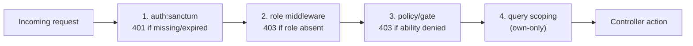

# Access Control

Status legend: see [root README](../README.md). All `REQUIRED`.

## Enforcement layers

| Layer | Mechanism (target) | Failure |
|---|---|---|
| Authentication | Laravel `auth:sanctum` middleware group on `/api/v1/*` protected routes | `401` JSON |
| Role | `role:ADMIN` middleware (custom, `REQUIRED`) registered in `bootstrap/app.php` alias | `403` JSON |
| Ability | Laravel policies/gates per module | `403` JSON |
| Own-scope | `->where('user_id', $request->user()->id)` in queries | `404` (not "found but not yours") |

## Route protection plan

- Public (`no auth`): register, login, password reset, catalog browse/search/detail, health `/up`.
- `auth` only: me/profile, own cart, own addresses, checkout/quote, own orders (+cancel-own ⚠ post-payment), payment verify.
- `auth + ADMIN`: everything under `/api/v1/admin/*` (products, inventory, orders, customers), order status updates.

State today: `bootstrap/app.php` middleware block is empty (`IMPLEMENTED` skeleton), `auth:sanctum` unworkable until Sanctum install — all enforcement `REQUIRED`.

## Admin-only operations (canonical list)

1. Product create/edit/image upload/price change/stock change/activate-deactivate
2. Inventory adjustments (incl. manual set)
3. Order status updates (per lifecycle rules)
4. Order cancellation (any order, any stage, with constraints)
5. Customer list/detail/block-unblock
6. Referral of refunds (`PLANNED` post-MVP)

Operational detail: [14-admin](../14-admin/README.md).
