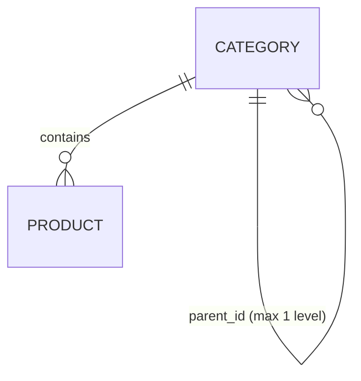

# Category Model

Status legend: see [root README](../README.md). All `REQUIRED`.

## Entity: `Category`

| Field | Type | Required | Unique | Notes |
|---|---|:---:|:---:|---|
| `id` | bigint PK | ✅ | ✅ | |
| `name` | string | ✅ | — | e.g. "Laptops" |
| `slug` | string | ✅ | ✅ | URL/client key, derived from name |
| `parent_id` | bigint FK, nullable | — | — | `NULL` = top-level; depth ≤ 1 for MVP |
| `is_active` | bool | ✅ | — | |
| `description` | text, nullable | — | — | optional display copy |
| `created_at`, `updated_at` | timestamps | ✅ | — | audit |

## Hierarchy

**Decision: one level of nesting for MVP** (top-level + optional children), capped (`parent_id` NULL or a top-level id). Deeper trees are `PLANNED` (closure-table) post-MVP.

## Product relationship

- Every `Product` belongs to exactly one `Category` ([06-products/product-model.md](../06-products/product-model.md)).
- Products render under their category regardless of the category's activation state (see business rules).

## Status

Entity, migration, model, and everything listed above: `REQUIRED` — nothing exists yet.
