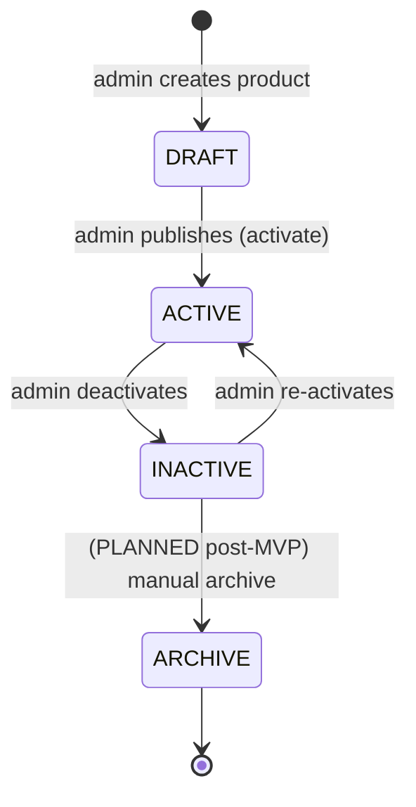

# Product Lifecycle

Status legend: see [root README](../README.md).

Only these three statuses are used; they are the **proposed MVP set** (`REQUIRED` to implement — none exists yet):

| Status | Public visibility | Purchasable | Typical use |
|---|---|---|---|
| `DRAFT` | hidden | no | setup before images/prices final |
| `ACTIVE` | visible (browse/search/category/jump-link) | yes (while stock lasts) | normal on-sale state |
| `INACTIVE` | hidden to customers | no | stock-out without deleting, corrections |

## Rules

1. Transition `ACTIVE → DRAFT` is **not allowed** (protect order references); use `INACTIVE` instead.
2. Transition to `ARCHIVE` (`PLANNED` post-MVP) requires no pending orders; MVP keeps history via `INACTIVE` + soft-delete TBD ([product-model.md](product-model.md)).
3. Admin edit of an `ACTIVE` product is allowed anytime; changes apply immediately.
4. Orders already placed keep their snapshots regardless of later status ([11-orders/order-model.md](../11-orders/order-model.md)).
5. An activated product with `stock_quantity = 0` displays "Out of stock" but stays browsable ([07-inventory/stock-flow.md](../07-inventory/stock-flow.md)).
