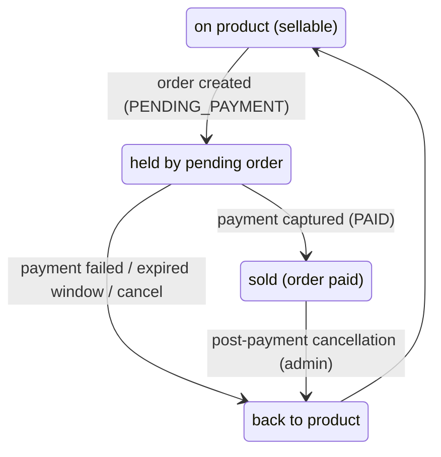

# Stock Flow

Status legend: see [root README](../README.md). All `REQUIRED`.

## Step rules

| Step | Trigger | Rule |
|---|---|---|
| 1. Cart add check | cart item create/update | `stock_quantity ≥ requested qty` (warn-only semantics TBD — cart allows transient over-added items, checkout still blocks) |
| 2. Reserve | order created (`PENDING_PAYMENT`) | conditional atomic decrement; two concurrent orders: loser gets `409` |
| 3. Hold window | order pending | expires in `PAYMENT_WINDOW_MIN` (**TBD value, suggested 30 min**) → cron restores stock |
| 4. Deduct (confirm) | payment verified / webhook | stock stays deducted; reservation becomes a sale |
| 5. Restore | pay-fail/expiry/pre-shipment-cancel | exact pre-reservation quantity returned |
| 6. Dawn-and-dusk drift guard | admin ops | manual recount via dedicated stock PATCH ([api.md](api.md)) |

## Order impact summary

- Order created → stock reserved (not yet sold).
- Payment verified → stock definitively sold.
- Fail/expire/cancel → restored.
- No restock on `DELIVERED`/`COMPLETED`; post-payment cancellation restores but is admin-only and logged.

## Edge rules

1. Product `INACTIVE` with reserved stock: reservations honored; no new checkout.
2. `skipStockCheck` / unlimited stock: **not supported** — every purchasable product must have stock accounting.
3. Concurrent add-to-cart beyond stock: cart accepts (rule 1), checkout/quote rejects with `409` ([10-checkout/validation.md](../10-checkout/validation.md)).
