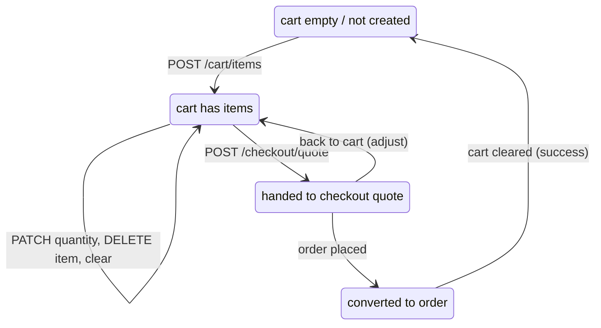

# Cart Flow

Status legend: see [root README](../README.md). All `REQUIRED`.

## Item rules along the flow

1. **Add** — product must be `ACTIVE`; quantity ≥ 1; stock soft-checked (warn hint only) ([07-inventory/stock-flow.md](../07-inventory/stock-flow.md) rule 1); duplicate product merges into one row with summed quantity.
2. **Read** — server returns live `effective_price` and totals every time; if price changed since `price_at_add`, payload includes `price_changed: true` per item (UX: show "price updated" once).
3. **Update** — setting quantity to 0 = remove; quantity clamped to remaining stock at **checkout**, not in cart.
4. **Remove/Clear** — immediate, idempotent.
5. **Stale items** — at quote time, items whose product became inactive/deleted are excluded from pricing and reported back in `issues[]` for UI cleanup (exact behavior: auto-remove + notify; TBD confirm UX).
6. **Checkout success** — cart rows are deleted (not archived); order history lives in orders. Cart persistence ends at conversion ([business-rules.md](business-rules.md)).
