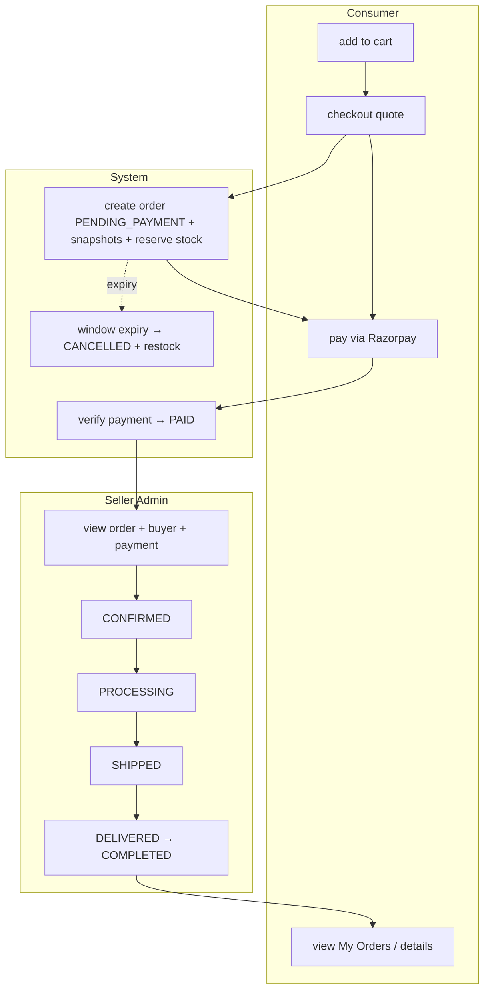

# Order Flow

Status legend: see [root README](../README.md). All `REQUIRED`.

## From cart to completed, who does what

## Step owners

| Step | Actor | Action | Doc |
|---|---|---|---|
| create | system (consumer trigger) | order + snapshots + reservation | [10-checkout/checkout-flow.md](../10-checkout/checkout-flow.md) |
| pay | consumer (Razorpay) + system (verify) | `PENDING_PAYMENT → PAID` | [12-payments/payment-flow.md](../12-payments/payment-flow.md) |
| accept → pack → ship | **seller/admin** | status updates | [14-admin/order-management.md](../14-admin/order-management.md) |
| deliver/complete | admin (MVP) | `SHIPPED → DELIVERED → COMPLETED` | same |
| cancel | user (window) / admin | see rules | [business-rules.md](business-rules.md) |

## Seller's order-management loop (the demo back-half)

1. Login admin → Dashboard shows new orders count ([14-admin/dashboard.md](../14-admin/dashboard.md)).
2. Orders list filtered `PAID`/`CONFIRMED` first.
3. Open order → verify payment status `PAID` + amount matches (`grand_total` ↔ payment `amount`) ([12-payments/README.md](../12-payments/README.md)).
4. Update status: `CONFIRMED` → `PROCESSING` → `SHIPPED` → `DELIVERED`.
5. Customer sees each change in My Orders ([13-consumer-app/shopping-flow.md](../13-consumer-app/shopping-flow.md)).

## Notifications along the flow

None in MVP (SMS/WhatsApp/email are FUTURE — [21-future-scope/notifications.md](../21-future-scope/notifications.md)). Consumers poll My Orders; the demo shows status flips live on both devices.
