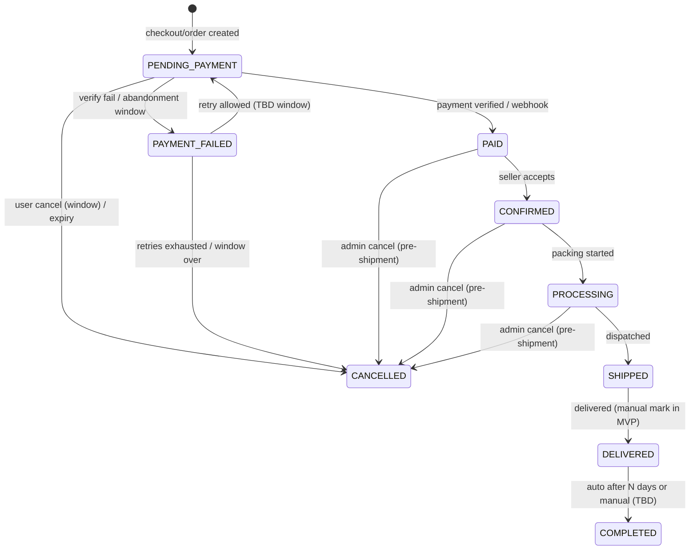

# Order Lifecycle

Status legend: see [root README](../README.md).

## Proposed lifecycle (target) — `REQUIRED` to implement

## Status truth table — implemented or not?

| Status | In code today | Verdict |
|---|---|---|
| all of the above | nothing exists | **`REQUIRED`** — this lifecycle is *proposed*, not implemented |

| Status | Meaning | Who moves it | Allowed exits |
|---|---|---|---|
| `PENDING_PAYMENT` | order created, awaiting capture | system (payment/webhook/expiry) | `PAID`, `PAYMENT_FAILED`, `CANCELLED` |
| `PAID` | money captured & verified | system | `CONFIRMED`, `CANCELLED` (admin) |
| `CONFIRMED` | seller accepted | admin | `PROCESSING`, `CANCELLED` (admin) |
| `PROCESSING` | being packed | admin | `SHIPPED`, `CANCELLED` (admin) |
| `SHIPPED` | in transit | admin | `DELIVERED` |
| `DELIVERED` | received | admin (manual MVP) | `COMPLETED` |
| `COMPLETED` | terminal success | system/manual (TBD trigger) | — |
| `PAYMENT_FAILED` | capture failed | system | `PENDING_PAYMENT` (retry), `CANCELLED` |
| `CANCELLED` | terminal failure/pre-shipment exit | user(admin-window)/system/admin | — |

## Rules

1. **Only the transitions above are legal**; anything else → `422` (state machine enforced server-side).
2. Admin is the mover for `CONFIRMED → … → DELIVERED` ([14-admin/order-management.md](../14-admin/order-management.md)); customer cannot advance fulfillment.
3. Post-payment cancellation (`PAID/CONFIRMED/PROCESSING`) restores stock ([business-rules.md](business-rules.md) rule 4).
4. Status history logging: `PLANNED` (timeline UI `FUTURE`); MVP stores current status + timestamps only.
5. No `RETURNED`/`REFUNDED` states in MVP — refunds are `PLANNED` post-MVP ([12-payments/README.md](../12-payments/README.md)).
