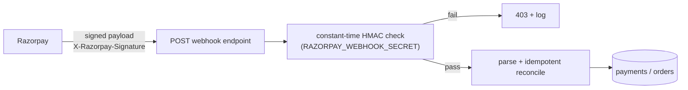

# Payment Webhooks

Status legend: see [root README](../README.md). All `REQUIRED`.

## Contract

| Event | Action |
|---|---|
| `payment.captured` | verify HMAC → reconcile: Payment `CAPTURED`, Order → `PAID` (if not already) |
| `payment.failed` | Payment `FAILED`, Order → `PAYMENT_FAILED` (if still pending) |
| (ignored events) | `200` no-op, logged |

Endpoint: `POST /api/v1/payments/webhook/razorpay` (from [api.md](api.md)).

## Trust model

1. **Signature first** — payload untrusted until HMAC passes; secret never leaves the server.
2. **Never trust event amounts** — reconcile against local `Payment.amount`/`Order.grand_total`; mismatch → log + manual review (no auto-state-change).
3. **Client path vs webhook race** — both may fire; reconcile is idempotent (first write wins, replays no-op) ([payment-flow.md](payment-flow.md) rule 4).
4. **Replay safety** — dedupe on `provider_payment_id` + event id (storage TBD: dedupe table vs status check; confirm at implementation).
5. **Always `200`** after processing (or deliberate `403` on bad signature) so Razorpay doesn't retry valid-but-ignored events.
6. **Backstop value** — completes orders for users who never return to the app after paying ([payment-flow.md](payment-flow.md) rule 6).
