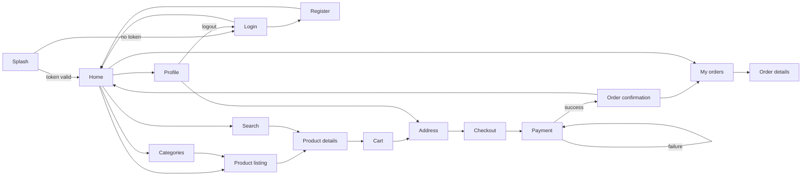

# Navigation

Status legend: see [root README](../README.md). All `REQUIRED`; router package TBD ([01-architecture/frontend-architecture.md](../01-architecture/frontend-architecture.md)).

## Rules

1. **Auth guard** — Cart/Address/Checkout/Payment/Orders/Profile require a token; unauthenticated → Login (return-to-intent TBD at implementation).
2. **Checkout stack** — back from Payment→Checkout→Cart is allowed until payment succeeds; after success, back lands on Home/Orders (no re-entering a paid checkout).
3. Deep-link/product share (`ecom_mob` scheme) is `PLANNED`; only in-app navigation in MVP.
4. Bottom tabs suggested (Home/Categories/Cart/Profile) — exact IA TBD with design.
