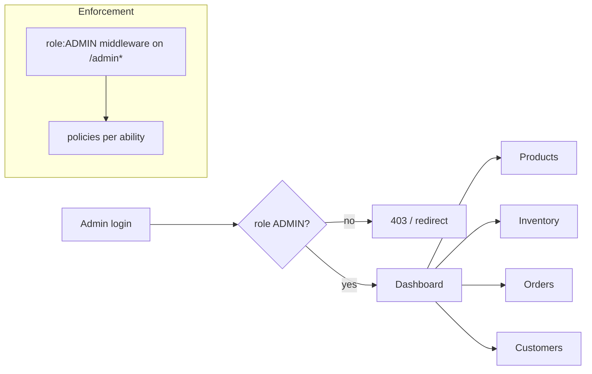

# Admin Access Control

Status legend: see [root README](../README.md). All `REQUIRED`.

## Login

- Same credential surface as consumers (email+password) but the account carries `ADMIN` (seeded — never via public register, [04-roles-permissions/roles.md](../04-roles-permissions/roles.md)).
- Session cookie auth on the web console (same-origin) or token — final mode TBD ([02-authentication/authentication-flow.md](../02-authentication/authentication-flow.md) modes table).
- Failed logins rate-limited ([02-authentication/security.md](../02-authentication/security.md)).

## Protection model

1. All admin routes mount under an `ADMIN`-gated group (web + API).
2. Customer tokens cannot reach any `/admin*` route (`403`).
3. Privilege escalation impossible from the UI: no role-assignment screen in MVP (roles via seeder/CLI only — [04-roles-permissions/permissions.md](../04-roles-permissions/permissions.md) `roles.assign`).
4. Admin action audit log: `PLANNED` (status changes/reasons are captured ad-hoc in MVP fields like `cancellation_reason`).

Cross-refs: enforcement layers [04-roles-permissions/access-control.md](../04-roles-permissions/access-control.md); admin-only op list (canonical) in same doc.
