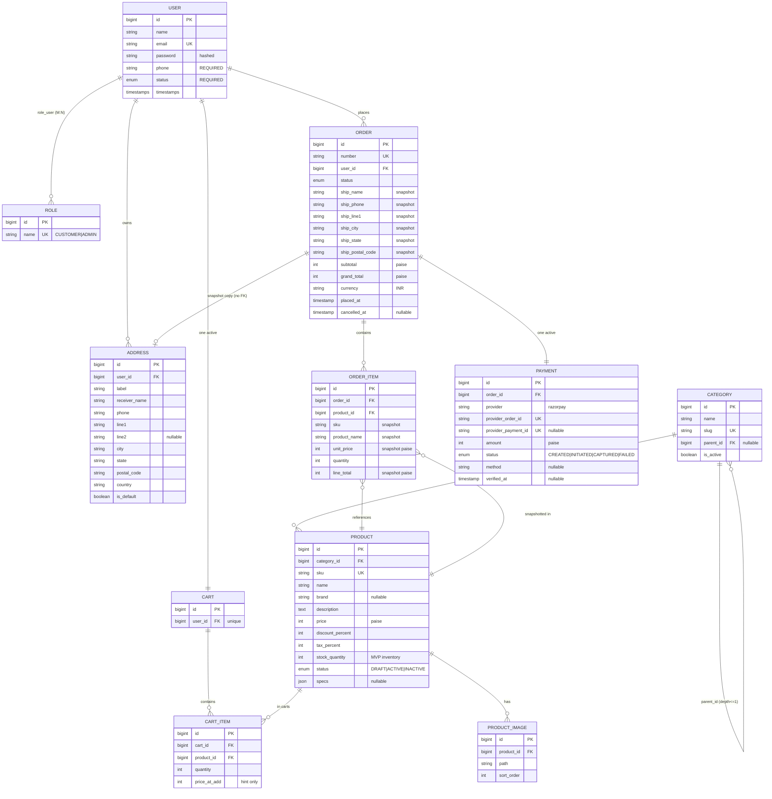

# ERD

Status legend: see [root README](../README.md). MVP schema target — all `REQUIRED` except User (`PARTIALLY IMPLEMENTED`). Inventory = stock column on Product; Permission table = `PLANNED`.

Reading notes: dashed intent (snapshot on address) is represented by the "snapshot copy" label — order holds copied fields, not a live relation. Permission entity intentionally omitted (`PLANNED`, [entities.md](entities.md)).
